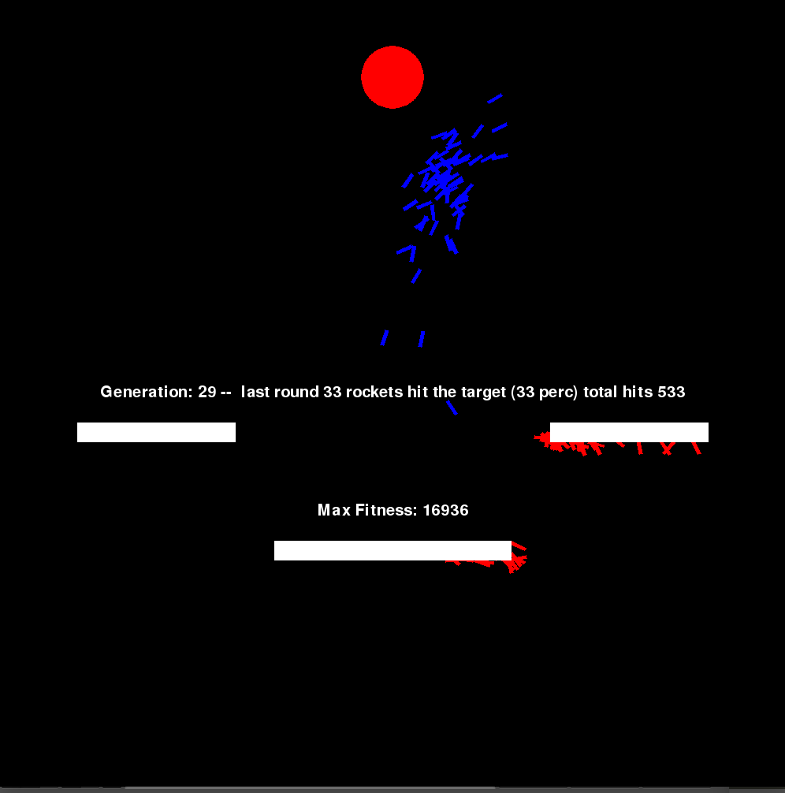

# PyRockets

An attempt at genetic algorithms.

The idea is heavily influenced by Daniel Shiffman (The Nature of Code) and his code challenge about smart rockets (https://www.youtube.com/watch?v=bGz7mv2vD6g).

# Prerequisites

You need to have a valid installation of python (2.7), `pygame` (http://www.pygame.org/download.shtml), and `numpy` (https://docs.scipy.org/doc/numpy-1.10.1/user/install.html).

# Install/Run PyRockets

In order to install/run the simulation.

Download the folder manually and extract the content (hit download zip on the topright) or use `git clone https://github.com/DavZim/pyrockets.git`.

Once downloaded, move to the folder and execute the `main.py`-file either through an IDE (i.e., PyCharm) or run `python main.py`. 

Once the programm is running, you should see something like this:

If you have any questions or feedback, please get in contact with me: david_j_zimmermann@hotmail.com